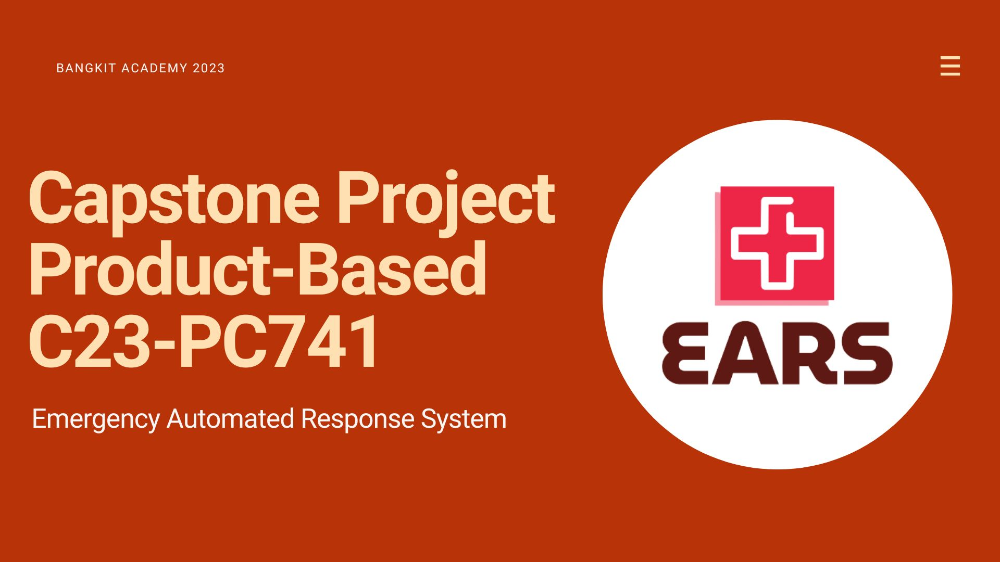

<h1>EARS (Emergency Automated Responce System)</h1>

EARS Project
An Android mobile-based emergency call application that simplifies the process for patients to call an ambulance. It utilizes geolocation filtering, allowing users to quickly access the nearest ambulance during a crisis to overcome the critical "golden hours."
In addition to emergencies, users can search for nearby hospitals and easily locate them through Google Maps for added convenience.

<h1>~Follow The Team~ 😆</h1>

# The Team
- Machine Learning Cohort 
   -  Halida Meiza ( M166DSY0404 )
   -  Adam Ramdan ( M257DSX0114 )
   -  Adam Mail ( M038DSX3055 )
- Mobile Development Cohort 
   -  Raihanna Ilfa Widjayanti Roilan ( A1234M1234 )
- Cloud Computing Cohort 
   - Pande Komang Abel Edgar Yoshuara ( C028DSX3138 ) 
   - Jonathan Adrian Chandra ( C351DSX0762 ) 
   - Syifa Alya Rahmadhani  ( C169DKY4817 )
 
 # Theme
 Post-Pandemic and Emergency Responses.
 

