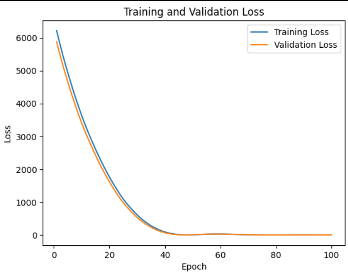
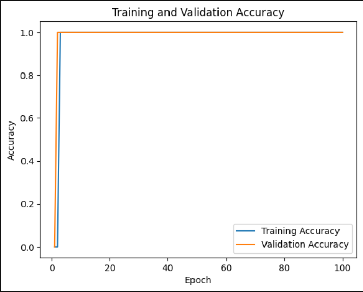
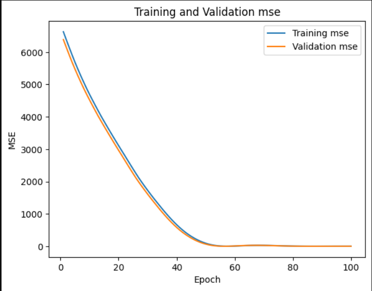

# Machine Learning Path Repository 
This repository used for Data Preprocessing and creating the model for EARS. We use android-based on gmaps API and content based filtering for determine the nearest path and recomendation hospital for user. At the end of the model , we will transform the model to tflite
# Work Flow 
1. Data Collecting 
2. Gmaps API Processing
3. Creating Model of Recommendation Hospital 
4. Convert to TF-Lite
5. Deploy to Android 
# Data Collecting 

# Creating Model 

# Graf

